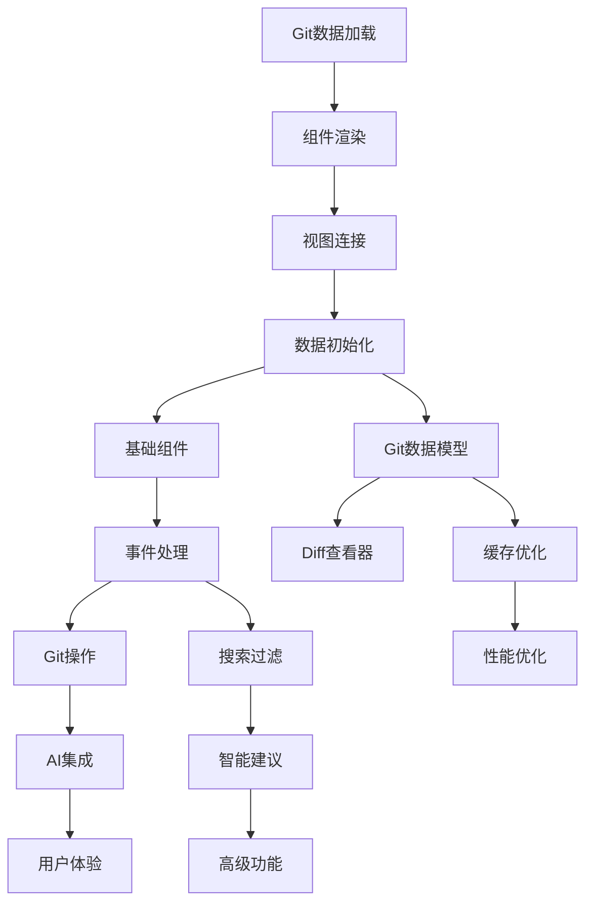

# TUI 统一界面实现任务清单

## 🎯 执行优先级（P0-P4）

### P0 - 紧急阻塞（必须立即解决）
让 `--tui-unified` 能基本运行并显示真实数据

### P1 - 核心功能（MVP必需）
基础的 Git 仓库浏览功能

### P2 - 重要功能（提升可用性）
Git 操作和搜索功能

### P3 - AI 集成（核心价值）
集成 AI Commit 功能

### P4 - 优化增强（用户体验）
高级功能和性能优化

---

## 🚀 P0 - 紧急阻塞任务（今天必须完成）

### Task 0.1: Git 数据加载 🚨
**阻塞问题**: 所有数据都是硬编码，无法显示真实 Git 信息
**解决方案**: 实现真实的 Git 命令执行

**📋 需求依据:**
- **FR-001** (系统需求文档.md) - 自动提交信息生成，需要Git数据
- **NFR-001** (系统需求文档.md) - 性能需求，异步处理

**🏗️ 技术指导:**
- **TUI_TECHNICAL_DESIGN.md** §Git操作异步流程
- **TUI_API_DESIGN.md** §Git操作接口
- **参考实现**: `src/tui_hierarchical.rs:285-426` load_git_data()

#### 立即修改（可直接复制）：
**文件**: `src/tui_unified/git/interface.rs`

```rust
// 替换第 27-37 行的 get_commits 方法
async fn get_commits(&self, limit: Option<u32>) -> Result<Vec<Commit>, Box<dyn std::error::Error>> {
    use tokio::process::Command;

    let limit = limit.unwrap_or(50);
    let output = Command::new("git")
        .args(&["log", "--pretty=format:%H|%h|%an|%ae|%ad|%s", "--date=iso", "-n", &limit.to_string()])
        .output()
        .await?;

    let stdout = String::from_utf8_lossy(&output.stdout);
    let commits = stdout
        .lines()
        .filter_map(|line| {
            let parts: Vec<&str> = line.split('|').collect();
            if parts.len() >= 6 {
                Some(Commit {
                    hash: parts[0].to_string(),
                    short_hash: parts[1].to_string(),
                    author: parts[2].to_string(),
                    author_email: parts[3].to_string(),
                    date: chrono::DateTime::parse_from_rfc3339(parts[4]).ok()?,
                    message: parts[5..].join("|"),
                    // 其他字段先用默认值
                    ..Default::default()
                })
            } else {
                None
            }
        })
        .collect();

    Ok(commits)
}

// 添加 get_branches 实现
async fn get_branches(&self) -> Result<Vec<Branch>, Box<dyn std::error::Error>> {
    use tokio::process::Command;

    let output = Command::new("git")
        .args(&["branch", "-a", "--format=%(refname:short)|%(HEAD)"])
        .output()
        .await?;

    let stdout = String::from_utf8_lossy(&output.stdout);
    let branches = stdout
        .lines()
        .filter_map(|line| {
            let parts: Vec<&str> = line.split('|').collect();
            if parts.len() >= 1 {
                let name = parts[0].trim().to_string();
                let is_current = parts.get(1).map_or(false, |&h| h == "*");
                Some(Branch::new(name, is_current))
            } else {
                None
            }
        })
        .collect();

    Ok(branches)
}
```

### Task 0.2: 组件渲染系统 🚨
**阻塞问题**: Component trait 是空的，无法渲染任何内容
**解决方案**: 定义基础 Component trait

**📋 需求依据:**
- **需求文档.md** §用户界面 - 直观的TUI界面设计
- **NFR-004** (系统需求文档.md) - 可维护性需求，模块化设计

**🏗️ 技术指导:**
- **TUI_TECHNICAL_DESIGN.md** §组件系统架构
- **TUI_CORE_MODULES.md** §components/ - 组件模块设计
- **参考实现**: `src/tui_enhanced.rs` 的组件实现模式

**文件**: `src/tui_unified/components/base/component.rs`

```rust
use ratatui::Frame;
use ratatui::layout::Rect;
use crossterm::event::KeyEvent;
use crate::tui_unified::state::AppState;
use crate::tui_unified::Result;

/// 组件基础 trait
pub trait Component {
    /// 渲染组件
    fn render(&mut self, f: &mut Frame, area: Rect, state: &AppState);

    /// 处理按键事件
    fn handle_key_event(&mut self, key: KeyEvent, state: &mut AppState) -> Result<bool>;

    /// 组件挂载时调用
    fn mount(&mut self, _state: &mut AppState) {}

    /// 组件卸载时调用
    fn unmount(&mut self, _state: &mut AppState) {}

    /// 更新组件状态
    fn update(&mut self, _state: &mut AppState) {}
}
```

### Task 0.3: 连接视图渲染 🚨
**阻塞问题**: app.rs 只显示静态文本
**解决方案**: 根据 AppState 显示真实数据

**📋 需求依据:**
- **FR-001** (系统需求文档.md) - 显示Git仓库信息
- **NFR-001** (系统需求文档.md) - 性能需求，响应式界面

**🏗️ 技术指导:**
- **TUI_TECHNICAL_DESIGN.md** §渲染流程
- **TUI_COMPONENT_RELATIONSHIPS.md** - 组件数据流
- **参考实现**: `src/tui_hierarchical.rs:1378-1405` render_commit_list()

**文件**: `src/tui_unified/app.rs` 的 `render` 方法

```rust
// 修改 render 方法中的主内容区（约第 132-140 行）
fn render(&mut self, frame: &mut ratatui::Frame) {
    // ... 前面的代码保持不变 ...

    // 主内容区 - 显示真实的 Git 提交列表
    let state = self._state.blocking_read(); // 获取状态

    let content_text = if state.repo_state.commits.is_empty() {
        "Loading commits...".to_string()
    } else {
        state.repo_state.commits
            .iter()
            .take(10)
            .map(|c| format!("{} - {}", &c.short_hash, &c.message))
            .collect::<Vec<_>>()
            .join("\n")
    };

    let content = Paragraph::new(Text::raw(content_text))
        .block(Block::default().title("Git Log").borders(Borders::ALL).border_style(content_style));
    frame.render_widget(content, layout.content);

    // ... 后面的代码保持不变 ...
}
```

### Task 0.4: 初始化 Git 数据 🚨
**阻塞问题**: AppState 创建时不加载 Git 数据
**解决方案**: 在初始化时加载数据

**📋 需求依据:**
- **FR-001** (系统需求文档.md) - 自动提交信息生成，需要Git数据
- **NFR-002** (系统需求文档.md) - 可靠性需求，数据完整性

**🏗️ 技术指导:**
- **TUI_TECHNICAL_DESIGN.md** §状态管理系统 - 数据初始化流程
- **TUI_API_DESIGN.md** §状态管理接口
- **参考实现**: `src/tui_hierarchical.rs:238-284` run() 方法的初始化逻辑

**文件**: `src/tui_unified/app.rs` 的 `run_loop` 方法

```rust
// 取消注释第 87-88 行，添加实现
async fn run_loop<B>(&mut self, terminal: &mut Terminal<B>) -> Result<()>
where
    B: ratatui::backend::Backend,
{
    // 初始化Git数据
    self.load_initial_git_data().await?;

    // ... 后续代码不变 ...
}

// 添加新方法
impl TuiUnifiedApp {
    async fn load_initial_git_data(&mut self) -> Result<()> {
        use crate::tui_unified::git::interface::{GitRepositoryAPI, AsyncGitImpl};

        let git = AsyncGitImpl::new(std::env::current_dir()?);

        // 加载提交历史
        if let Ok(commits) = git.get_commits(Some(50)).await {
            let mut state = self._state.write().await;
            state.repo_state.update_commits(commits);
        }

        // 加载分支列表
        if let Ok(branches) = git.get_branches().await {
            let mut state = self._state.write().await;
            state.repo_state.update_branches(branches);
        }

        Ok(())
    }
}
```

---

## 📊 P1 - 核心功能任务（本周完成）

### Task 1.1: 完善 Git 数据模型

**📋 需求依据:**
- **FR-001** (系统需求文档.md) - 自动提交信息生成，需要完整Git数据
- **FR-004** (系统需求文档.md) - Tag 管理功能
- **NFR-001** (系统需求文档.md) - 性能需求，数据结构优化

**🏗️ 技术指导:**
- **TUI_CORE_MODULES.md** §git/models.rs - Git数据模型定义
- **TUI_API_DESIGN.md** §Git数据结构
- **参考实现**: `src/git/commit.rs` 和 `src/git/tag.rs`

**任务清单:**
- [ ] 实现完整的 Commit 结构体字段解析
- [ ] 实现 Branch 的 upstream 和 ahead/behind 信息
- [ ] 实现 Tag 列表获取和解析
- [ ] 实现 git status 解析

### Task 1.2: 实现基础组件

**📋 需求依据:**
- **需求文档.md** §用户界面 - 直观的TUI界面设计
- **NFR-004** (系统需求文档.md) - 可维护性需求，组件化设计

**🏗️ 技术指导:**
- **TUI_TECHNICAL_DESIGN.md** §组件系统架构
- **TUI_CORE_MODULES.md** §components/base/ - 基础组件设计
- **参考实现**: `src/tui_enhanced.rs` 的组件实现

**任务清单:**
- [ ] 实现 ListWidget 通用列表组件
- [ ] 实现 SidebarPanel 菜单组件
- [ ] 实现 GitLogView 提交列表视图
- [ ] 实现 BranchesView 分支列表视图

### Task 1.3: 完善事件处理

**📋 需求依据:**
- **FR-005** (系统需求文档.md) - 多层级配置系统，自定义按键绑定
- **NFR-001** (系统需求文档.md) - 性能需求，响应时间

**🏗️ 技术指导:**
- **TUI_TECHNICAL_DESIGN.md** §事件处理流程
- **TUI_CORE_MODULES.md** §events/ - 事件系统模块
- **参考实现**: `src/tui_hierarchical.rs:859-1083` handle_key_event()

**任务清单:**
- [ ] 实现数字键 1-6 切换视图
- [ ] 实现 j/k 列表导航
- [ ] 实现 Enter 选择操作
- [ ] 实现 / 进入搜索模式

### Task 1.4: 实现 Diff 查看器

**📋 需求依据:**
- **FR-003** (系统需求文档.md) - 智能大文件与多文件变更处理
- **需求文档.md** §用户界面 - 代码差异展示

**🏗️ 技术指导:**
- **TUI_TECHNICAL_DESIGN.md** §Diff查看器设计
- **TUI_CORE_MODULES.md** §components/widgets/diff_viewer.rs
- **参考实现**: `src/diff_viewer.rs` 完整的DiffViewer实现

**任务清单:**
- [ ] 基础 diff 显示
- [ ] 语法高亮支持
- [ ] 文件导航

---

## 🔧 P2 - 重要功能任务（下周完成）

### Task 2.1: Git 操作

**📋 需求依据:**
- **FR-004** (系统需求文档.md) - Tag 管理功能
- **需求文档.md** §Git操作 - 分支管理、文件操作
- **NFR-002** (系统需求文档.md) - 可靠性需求，错误处理

**🏗️ 技术指导:**
- **TUI_TECHNICAL_DESIGN.md** §Git操作异步流程
- **TUI_API_DESIGN.md** §Git操作接口
- **参考实现**: `src/git/core.rs` 和 `src/commands/flow.rs`

**任务清单:**
- [ ] 分支切换 (checkout)
- [ ] 分支创建/删除
- [ ] 文件 stage/unstage
- [ ] 查看文件差异

### Task 2.2: 搜索和过滤

**📋 需求依据:**
- **FR-001** (系统需求文档.md) - 自动提交信息生成，需要历史查询
- **NFR-001** (系统需求文档.md) - 性能需求，快速搜索响应

**🏗️ 技术指导:**
- **TUI_TECHNICAL_DESIGN.md** §智能搜索算法
- **TUI_CORE_MODULES.md** §algorithms/ - 搜索算法模块
- **参考实现**: `src/tui_enhanced.rs` 的搜索功能实现

**任务清单:**
- [ ] 提交消息搜索
- [ ] 作者过滤
- [ ] 日期范围过滤
- [ ] 搜索结果高亮

### Task 2.3: 缓存优化

**📋 需求依据:**
- **NFR-001** (系统需求文档.md) - 性能需求，响应时间优化
- **NFR-003** (系统需求文档.md) - 资源效率，内存使用优化

**🏗️ 技术指导:**
- **TUI_TECHNICAL_DESIGN.md** §缓存策略
- **TUI_CORE_MODULES.md** §cache/ - 缓存系统设计
- **参考实现**: `src/config/mod.rs` 的缓存实现模式

**任务清单:**
- [ ] Git 命令结果缓存
- [ ] 增量数据更新
- [ ] 后台数据刷新

---

## 🤖 P3 - AI 集成任务（第三周）

### Task 3.1: AI Commit 集成

**📋 需求依据:**
- **FR-001** (系统需求文档.md) - 自动提交信息生成
- **FR-002** (系统需求文档.md) - 多AI服务提供商支持
- **FR-003** (系统需求文档.md) - 智能大文件与多文件变更处理

**🏗️ 技术指导:**
- **TUI_TECHNICAL_DESIGN.md** §AI集成架构
- **TUI_API_DESIGN.md** §AI服务接口
- **参考实现**: `src/core/ai/` 模块和 `src/commands/commit.rs`

**任务清单:**
- [ ] 在 TUI 中调用 AI 生成提交信息
- [ ] 提交信息编辑界面
- [ ] AI 配置界面
- [ ] 执行提交操作

### Task 3.2: 智能建议

**📋 需求依据:**
- **FR-001** (系统需求文档.md) - 智能推断 scope 和 type
- **FR-003** (系统需求文档.md) - 智能作用域推断
- **需求文档.md** §AI功能 - 基于历史的优化

**🏗️ 技术指导:**
- **TUI_TECHNICAL_DESIGN.md** §智能分支操作算法
- **TUI_CORE_MODULES.md** §smart/ - 智能组件模块
- **参考实现**: `src/core/ai/agents/` 的智能推断逻辑

**任务清单:**
- [ ] 基于历史提交模式的建议
- [ ] 提交信息模板
- [ ] 智能 scope 推断

---

## ✨ P4 - 优化增强任务（持续改进）

### Task 4.1: 用户体验

**📋 需求依据:**
- **FR-005** (系统需求文档.md) - 多层级配置系统
- **NFR-004** (系统需求文档.md) - 可维护性需求
- **需求文档.md** §用户体验 - 界面友好性

**🏗️ 技术指导:**
- **TUI_TECHNICAL_DESIGN.md** §主题系统设计
- **TUI_API_DESIGN.md** §配置管理接口
- **参考实现**: `src/config/` 配置系统

**任务清单:**
- [ ] 主题系统
- [ ] 按键绑定自定义
- [ ] 命令面板
- [ ] 撤销/重做

### Task 4.2: 高级功能

**📋 需求依据:**
- **需求文档.md** §数据可视化 - 统计和图形展示
- **NFR-001** (系统需求文档.md) - 性能需求，大数据处理

**🏗️ 技术指导:**
- **TUI_TECHNICAL_DESIGN.md** §数据可视化设计
- **TUI_COMPONENT_RELATIONSHIPS.md** - 组件交互设计
- **参考实现**: `src/commands/history.rs` 的统计功能

**任务清单:**
- [ ] 提交图形显示
- [ ] 统计仪表板
- [ ] 文件树视图
- [ ] 批量操作

### Task 4.3: 性能优化

**📋 需求依据:**
- **NFR-001** (系统需求文档.md) - 性能需求，<100ms响应时间
- **NFR-003** (系统需求文档.md) - 资源效率，内存<50MB

**🏗️ 技术指导:**
- **TUI_TECHNICAL_DESIGN.md** §性能优化策略
- **TUI_CORE_MODULES.md** §algorithms/ - 虚拟滚动算法
- **参考实现**: 项目中的性能优化实践

**任务清单:**
- [ ] 虚拟滚动
- [ ] 懒加载
- [ ] 内存优化
- [ ] 渲染优化

---

## 📝 实施检查清单

### 每完成一个 P0 任务后检查：
- [ ] 代码能编译通过
- [ ] `cargo run -- --tui-unified` 能运行
- [ ] 能看到真实的 Git 数据
- [ ] 没有 panic 或崩溃

### 每完成一个 P1 任务后检查：
- [ ] 功能正常工作
- [ ] 用户交互流畅
- [ ] 错误处理完善
- [ ] 有基础测试

### 每完成一个 P2+ 任务后检查：
- [ ] 功能完整
- [ ] 性能良好
- [ ] 代码质量高
- [ ] 文档完善

---

## 🔄 任务依赖关系



---

## 🏁 成功标准

### P0 完成标准（今天）
✅ 运行 `cargo run -- --tui-unified` 能看到：
- 真实的 Git 提交历史
- 真实的分支列表
- 基础的键盘导航

### P1 完成标准（本周）
✅ 实现完整的 Git 仓库浏览器：
- 所有视图都能显示数据
- 流畅的导航体验
- Diff 查看功能

### P2 完成标准（下周）
✅ 支持基础 Git 操作：
- 能切换分支
- 能搜索和过滤
- 性能优化到位

### P3 完成标准（第三周）
✅ AI 功能完全集成：
- 能在 TUI 中生成提交信息
- 能直接提交代码

---

## 📚 参考资源

### 可复用代码位置：
1. **Git 命令执行**: `src/tui_hierarchical.rs:285-426`
2. **提交列表渲染**: `src/tui_hierarchical.rs:1378-1405`
3. **Diff 查看器**: `src/tui_enhanced.rs` 的 DiffViewer
4. **Git 核心功能**: `src/git/core.rs`

### 相关文档：
- [TUI_TECHNICAL_DESIGN.md](TUI_TECHNICAL_DESIGN.md) - 技术架构设计
- [TUI_CORE_MODULES.md](TUI_CORE_MODULES.md) - 核心模块设计
- [TUI_API_DESIGN.md](TUI_API_DESIGN.md) - API 接口设计
- [TUI_INTEGRATION_ANALYSIS.md](TUI_INTEGRATION_ANALYSIS.md) - 整合分析