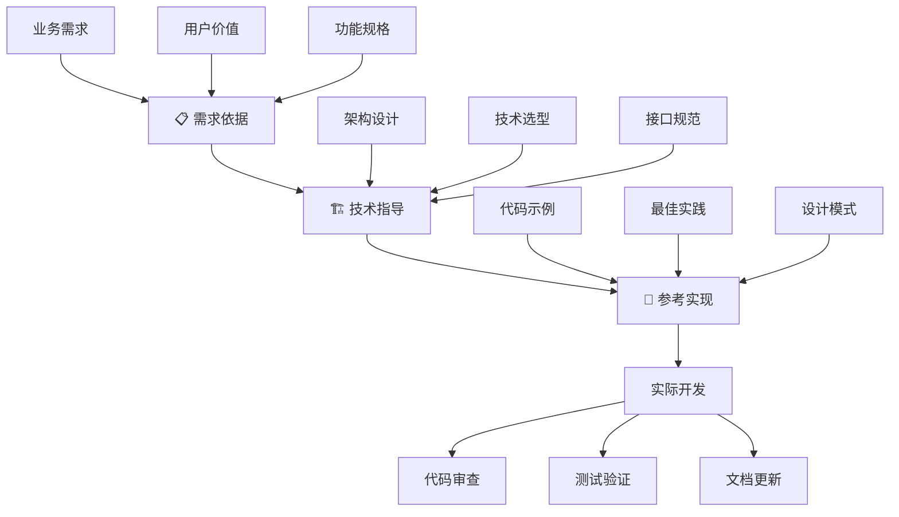

# 任务模式指导文档

## 概述

基于项目实际开发经验，形成了一套标准化的任务指导模式。每个开发任务遵循**三层指导框架**，确保从需求理解到技术实现的完整指导路径。

## 三层指导框架详解

### 第一层: 📋 需求依据 (为什么做)

**核心目标:** 明确任务的业务需求和功能价值，确保开发方向正确。

**信息来源:**
- **系统需求文档** - 功能需求 (FR) 和非功能需求 (NFR)
- **产品需求文档** - 用户需求和业务价值
- **技术债务清单** - 架构改进和重构需求

**格式模板:**
```markdown
**📋 需求依据:**
- **FR-XXX** (系统需求文档.md) - 功能需求简述
- **NFR-XXX** (系统需求文档.md) - 非功能需求简述
- **需求文档.md** §章节名 - 具体需求描述
```

**质量标准:**
- ✅ 需求编号准确且可追溯
- ✅ 业务价值和用户价值明确
- ✅ 优先级和紧急程度清晰
- ✅ 验收标准定义完整

**常见错误:**
- ❌ 缺少需求编号，无法追溯
- ❌ 描述模糊，缺少具体价值
- ❌ 引用错误的需求文档版本
- ❌ 混合多个不相关需求

### 第二层: 🏗️ 技术指导 (怎么设计)

**核心目标:** 提供技术架构设计和实现路径，确保技术方案合理。

**信息来源:**
- **技术架构文档** - 系统整体设计
- **模块设计文档** - 具体模块设计
- **API设计文档** - 接口规范和数据结构
- **技术选型文档** - 工具和框架选择

**格式模板:**
```markdown
**🏗️ 技术指导:**
- **技术设计文档.md** §架构章节 - 整体架构设计
- **模块设计文档.md** §模块定义 - 具体模块设计
- **API设计文档.md** §接口定义 - 接口设计规范
```

**设计要素:**
- **架构模式** - 采用的设计模式和架构风格
- **数据流向** - 数据在系统中的流转路径
- **依赖关系** - 模块间的依赖和调用关系
- **扩展性考虑** - 未来功能扩展的设计预留

**质量标准:**
- ✅ 技术方案与需求匹配
- ✅ 架构设计具有前瞻性
- ✅ 接口定义清晰完整
- ✅ 考虑了非功能需求 (性能、安全、可维护性)

### 第三层: 🔗 参考实现 (参考什么)

**核心目标:** 指向现有代码中的相关实现，提供具体代码参考和最佳实践。

**信息来源:**
- **现有代码库** - 类似功能的实现
- **核心模块** - 项目中的基础组件
- **最佳实践** - 团队认可的编码模式
- **第三方库** - 优秀的开源实现

**格式模板:**
```markdown
**🔗 参考实现:**
- `src/module/file.rs:行号-行号` - 功能名称
- `src/another/file.rs` - 完整模块实现
- 现有组件实现模式或设计模式
```

**参考类型:**
- **直接复用** - 可以直接复制或继承的代码
- **模式参考** - 类似的实现思路和设计模式
- **反面案例** - 需要避免的实现方式
- **性能基准** - 性能要求和基准测试

**选择标准:**
- ✅ 代码质量高，经过验证
- ✅ 功能相关性强，适合复用
- ✅ 遵循项目编码规范
- ✅ 性能和稳定性良好

## 三层指导的协作关系



## 指导层级的验证机制

### 需求验证
- **可追溯性检查** - 需求编号是否有效
- **一致性验证** - 任务目标与需求是否匹配
- **优先级确认** - 任务优先级是否合理

### 设计验证
- **架构一致性** - 技术方案与整体架构是否一致
- **接口兼容性** - 新接口与现有系统是否兼容
- **性能影响评估** - 技术方案对性能的影响

### 实现验证
- **代码质量** - 参考代码是否符合标准
- **功能完整性** - 参考实现是否覆盖需求
- **维护性评估** - 代码的可维护性和可扩展性

## 完整任务模板

### 任务标题: [功能描述]

**📋 需求依据:**
- **FR-001** (系统需求文档.md) - 主要功能需求
- **NFR-002** (系统需求文档.md) - 相关非功能需求
- **需求文档.md** §用户界面 - 具体用户需求

**🏗️ 技术指导:**
- **技术设计文档.md** §核心架构 - 整体设计思路
- **模块设计文档.md** §相关模块 - 模块间关系
- **API设计文档.md** §接口规范 - 接口设计标准

**🔗 参考实现:**
- `src/existing/module.rs:100-200` - 类似功能实现
- `src/core/base.rs` - 基础组件参考
- 项目中的成熟实现模式

**任务清单:**
- [ ] 具体实现步骤1
- [ ] 具体实现步骤2
- [ ] 具体实现步骤3
- [ ] 测试和验证

## 适用场景

### 1. 新功能开发
- 复杂功能模块
- 核心架构变更
- 用户界面开发

### 2. 重构任务
- 代码结构优化
- 性能改进
- 架构升级

### 3. 修复和维护
- Bug修复
- 功能增强
- 代码优化

### 4. 集成任务
- 第三方服务集成
- 模块间整合
- 系统对接

## 使用指南

### Step 1: 需求分析
1. 查阅相关需求文档
2. 识别功能需求 (FR) 和非功能需求 (NFR)
3. 明确任务的业务价值

### Step 2: 技术设计
1. 查阅技术设计文档
2. 确定实现架构
3. 明确模块依赖关系

### Step 3: 代码参考
1. 搜索项目中类似实现
2. 分析现有代码模式
3. 确定可复用组件

### Step 4: 任务执行
1. 按照三层指导开始开发
2. 定期检查指导文档
3. 确保实现符合设计

## 质量标准

### 需求依据质量
- ✅ 需求编号准确
- ✅ 来源文档明确
- ✅ 需求描述清晰
- ✅ 业务价值明确

### 技术指导质量
- ✅ 架构设计清晰
- ✅ 技术选型合理
- ✅ 实现路径明确
- ✅ 依赖关系清楚

### 参考实现质量
- ✅ 代码路径准确
- ✅ 功能相关性高
- ✅ 实现质量好
- ✅ 可复用程度高

## 维护和改进

### 文档更新
- 需求变更时更新需求依据
- 设计修改时更新技术指导
- 代码重构时更新参考实现

### 经验积累
- 记录成功实施的任务模式
- 总结常见问题和解决方案
- 完善指导模板

### 团队协作
- 统一任务描述格式
- 共享最佳实践
- 持续改进工作流程

## 实际案例

### 案例 1: Git 数据加载任务

**📋 需求依据:**
- **FR-001** (系统需求文档.md) - 自动提交信息生成，需要Git数据
- **NFR-001** (系统需求文档.md) - 性能需求，异步处理

**🏗️ 技术指导:**
- **TUI_TECHNICAL_DESIGN.md** §Git操作异步流程
- **TUI_API_DESIGN.md** §Git操作接口

**🔗 参考实现:**
- `src/tui_hierarchical.rs:285-426` load_git_data()

### 案例 2: 组件渲染系统

**📋 需求依据:**
- **需求文档.md** §用户界面 - 直观的TUI界面设计
- **NFR-004** (系统需求文档.md) - 可维护性需求，模块化设计

**🏗️ 技术指导:**
- **TUI_TECHNICAL_DESIGN.md** §组件系统架构
- **TUI_CORE_MODULES.md** §components/ - 组件模块设计

**🔗 参考实现:**
- `src/tui_enhanced.rs` 的组件实现模式

## 工具和资源

### 文档查找
- 使用 `grep` 查找相关需求编号
- 使用 `find` 定位设计文档
- 使用代码搜索找到参考实现

### 模板使用
- 复制完整任务模板
- 根据具体任务调整内容
- 确保三层指导完整

### 质量检查
- 验证文档引用准确性
- 确认代码路径有效性
- 检查需求覆盖完整性

## 总结

三层指导框架确保每个开发任务都有：
1. **明确的目标** - 需求依据提供方向
2. **清晰的路径** - 技术指导提供方法
3. **具体的参考** - 参考实现提供示例

这种模式显著提高了开发效率和代码质量，减少了返工和错误，建议在所有开发任务中采用。