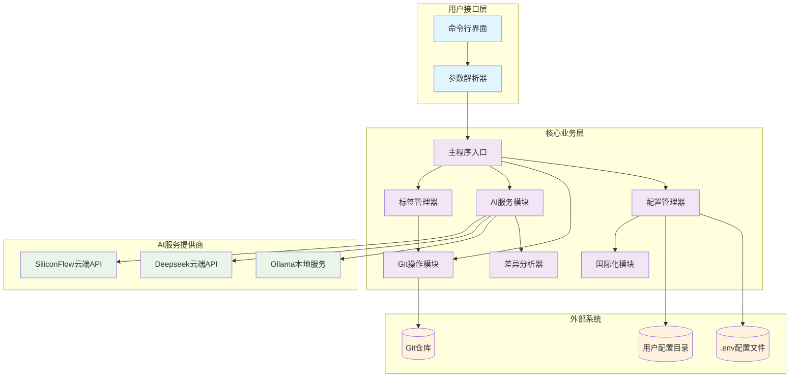
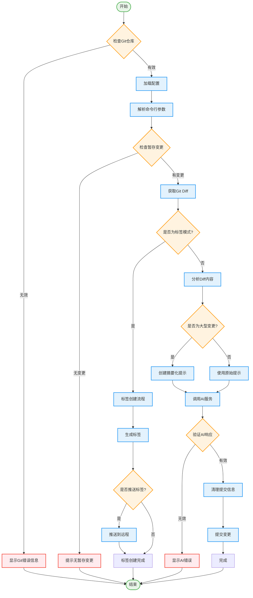
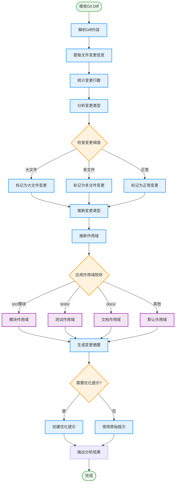
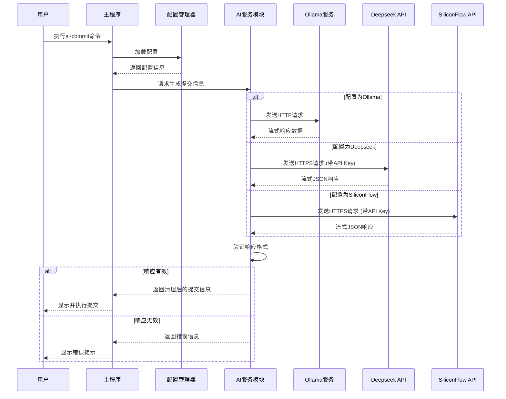
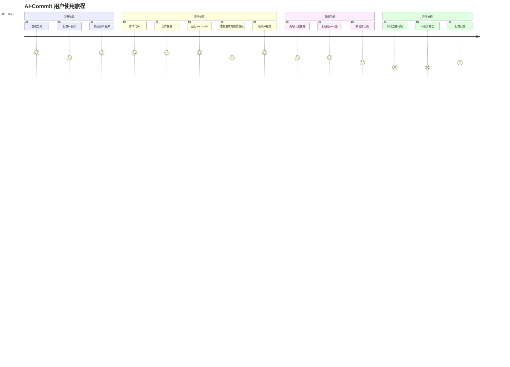
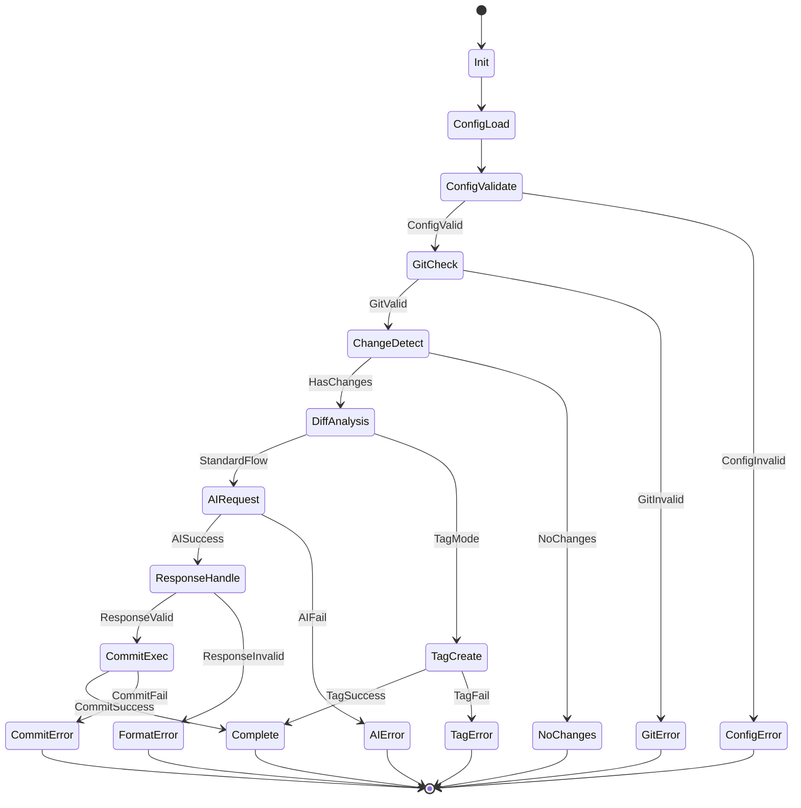
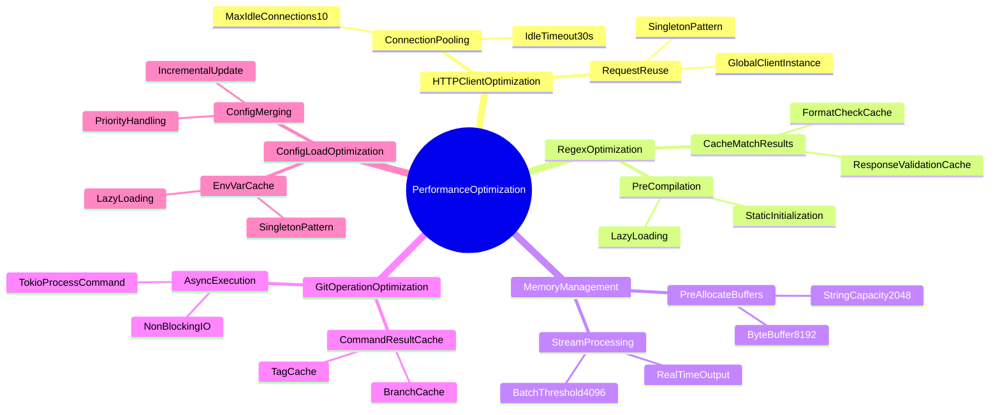
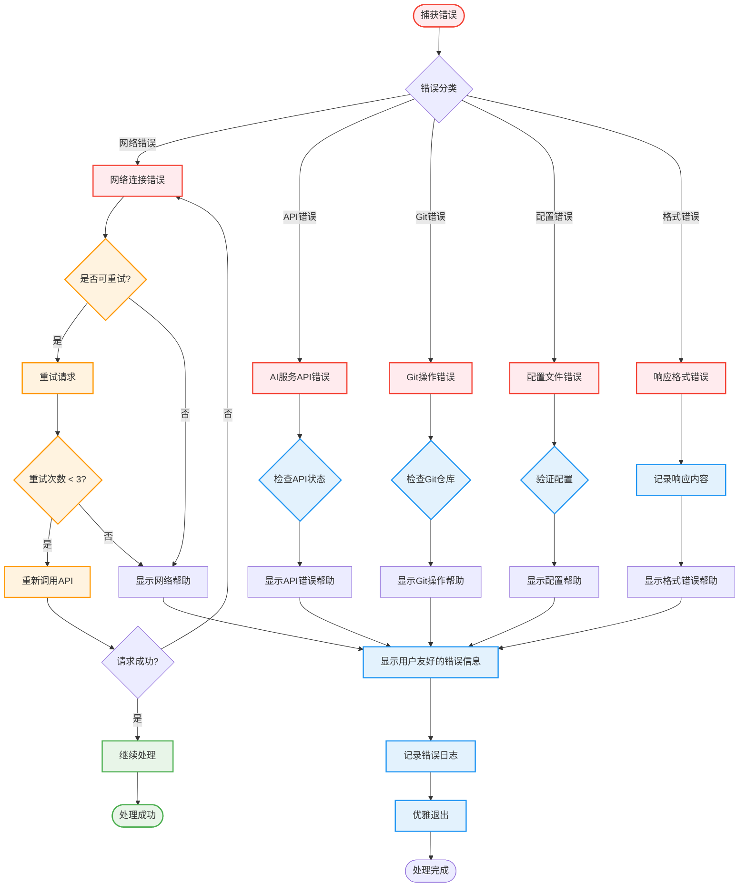
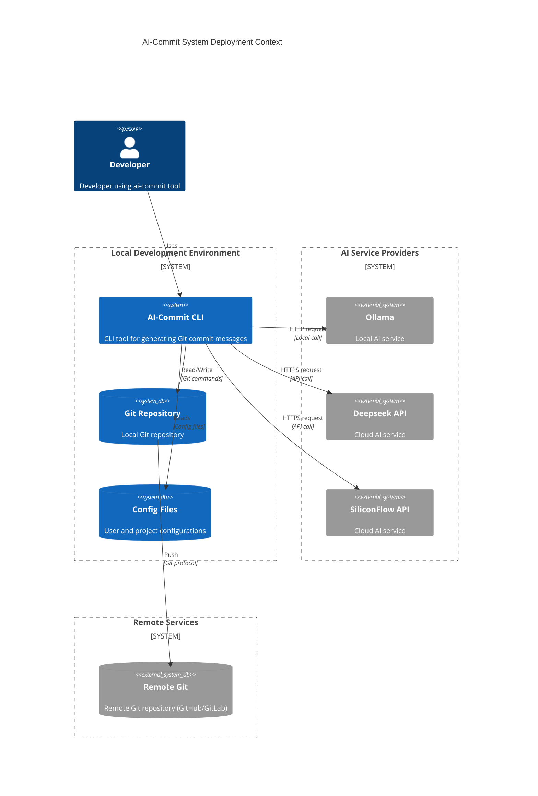

# AI-Commit 系统架构与流程图

## 1. 系统整体架构图

## 2. 系统主流程图

## 3. 差异分析器流程图

## 4. AI服务提供商集成流程图

## 5. 配置管理层次图

## 6. 用户交互流程图

## 7. 系统状态转换图

## 8. 性能优化策略图

## 9. 错误处理流程图

## 10. 部署架构图

---

以上流程图和架构图全面展示了AI-Commit系统的各个方面，包括：

1. **系统整体架构** - 展示各模块之间的关系和依赖
2. **主流程图** - 描述用户使用的完整流程
3. **差异分析器流程** - 详细展示智能分析的处理逻辑
4. **AI服务集成** - 说明与不同AI提供商的交互方式
5. **配置管理** - 展示多层级配置的加载和优先级
6. **用户交互旅程** - 从用户角度描述使用体验
7. **系统状态转换** - 展示系统各种状态之间的转换
8. **性能优化策略** - 总结各种性能优化方法
9. **错误处理流程** - 详细的错误分类和处理机制
10. **部署架构** - 展示系统在实际环境中的部署结构

这些图表为开发团队提供了清晰的技术实现指导，也为用户提供了系统功能的直观理解。